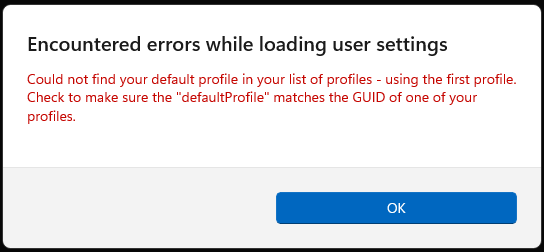

# C++ on WSL2 with VS Code and CMake

| Description    | Badge  |
| -------------- | ------ |
| Line Code Coverage  | [](https://htmlpreview.github.io/?https://github.com/brian-chau/cpp_makefile_google_test/blob/main/TestResults/CodeCoverage/index.html) |
| Fxn Code Coverage   | [](https://htmlpreview.github.io/?https://github.com/brian-chau/cpp_makefile_google_test/blob/main/TestResults/CodeCoverage/index.html) |
| Test Results        | [](https://github.com/brian-chau/cpp_makefile_google_test/blob/main/TestResults/lcov_results.txt) |

This is an example of how to use:
* Install Ubuntu in WSL2
* Setting up Visual Studio Code for GCC compiler for C++ applications

## Setting up WSL2

0. Removing old installations of WSL2 distributions
    1. Open your "Start" menu and search for "Settings" and start the "Settings" app.
    2. Under "Apps", select "Apps & features"
    3. Under "App list", in the "Search apps" field, type the name of the distribution that you installed in the first step (e.g. ubuntu)
    4. Click the three vertical dots icon to the far right of the distribution, and click Uninstall.


1. Install WSL
    1. Start "Command Prompt"
    2. Run `wsl --set-default-version 2`

2. Install Ubuntu 22
    1. In the Start menu, open the Microsoft Store, and search for Ubuntu 22.
    2. Select the item called "Ubuntu 22.04.1 LTS" and click "Install."
    3. Click "Open" to launch the command prompt and start the installation process.
        * If you encounter an error that says `There has been an error`, log out and log back in, and try again.
        * If you encounter an error that says `Failed to attach disk 'C:\Users\....\ext4.vhdx' to WSL2: The system cannot find the file` then do the following:
            1. Launch a new command prompt window by pressing `Ctrl+R`, then typing `cmd`
            2. Type `wsl --list` to find the distribution that used to be installed.
            3. Type `wslconfig /u <name of distribution that used to be installed>` to unlink the distribution.
            4. Return to the Windows Store to try again.
    4. When prompted for the initial account credentials, enter your Windows account username as your username, so that your Linux username will match your Windows username.
    5. Enter a password, and confirm the password.

3. Start WSL
    1. Press Ctrl+R
    2. Type `wsl`
    3. Press Enter
    4. If you see a popup that says this:
        * 
        * Right click on the title bar of the WSL command window > Settings.
        * In the bottom left hand corner, click "Open JSON file"
        * Scroll down to "profiles" JSON item, and find the "defaults" sub-item in there.
            * This will open the "settings.json" file.
        * Under the "profiles > list" item, copy the settings for "wsl"
            * For example, this might look like
                ```
                "default": {},
                "list":
                [
                    ...
                    {
                        "guid": "{<some-ascii-hex-string-separated-by-underscores>}",
                        "hidden": false,
                        "name": "Ubuntu-22.04",
                        "source": "Windows.Terminal.Wsl"
                    },
                    ...
                ]
                ```
            * Copy it so it looks like
                ```
                "default": {
                    "guid": "{<some-ascii-hex-string-separated-by-underscores>}",
                    "hidden": false,
                    "name": "Ubuntu-22.04",
                    "source": "Windows.Terminal.Wsl"
                },
                "list":
                [
                    ...
                    {
                        "guid": "{<some-ascii-hex-string-separated-by-underscores>}",
                        "hidden": false,
                        "name": "Ubuntu-22.04",
                        "source": "Windows.Terminal.Wsl"
                    },
                    ...
                ]
                ```

4. Fix the command line path name.
    1. Edit the ~/.bashrc file.
        * At the top of the file, paste the following code snippet, where <current_directory> is the name of the
          mount point shown in the console window (e.g. "/mnt/c/Users/`username`")
            ```
            if [[ $PWD == /mnt/c/Users/$USER ]]; then
              cd /home/$USER/user
            else
              case $PWD/ in
                /mnt/c/Users/$USER/*)
                  without_prefix=${PWD#/mnt/c/Users/$USER/}
                  cd /home/$USER/user/user/$without_prefix
                  ;;
              esac
            fi
            ```
    2. Look for the line that says `if [ "$color_prompt" = yes ]; then`
        * In the following line, remove the part that specifies the username "\u" and the host name "\h"
        * Do the same for the "else" block.
        * For example, it might look like this:
            ```
            if [ "$color_prompt" = yes ]; then
                PS1='${debian_chroot:+($debian_chroot)}\[\033[01;32m\]\u@\h\[\033[00m\]:\[\033[01;34m\]\w\[\033[00m\]\$ '
            else
                PS1='${debian_chroot:+($debian_chroot)}\u@\h:\w\$ '
            fi
            ```
        * Change it to this:
            ```
            if [ "$color_prompt" = yes ]; then
                PS1='${debian_chroot:+($debian_chroot)}\[\033[01;34m\]\w\[\033[00m\]\$ '
            else
                PS1='${debian_chroot:+($debian_chroot)}\w\$ '
            fi
            ```
        * Also remove the `\u@\h` details from the title bar
            ```
            case "$TERM" in
            xterm*|rxvt*)
                PS1="\[\e]0;${debian_chroot:+($debian_chroot)}\u@\h: \w\a\]$PS1"
                ;;
            *)
                ;;
            esac
            ```
        * Change it to this:
            ```
            case "$TERM" in
            xterm*|rxvt*)
                PS1="\[\e]0;${debian_chroot:+($debian_chroot)}\w\a\]$PS1"
                ;;
            *)
                ;;
            esac
            ```
    3. Save and exit.
    4. In the bash terminal, type the following commands:
        ```
        cd
        mkdir user
        ln -s /mnt/c/Users/$USER ~/user/user
        ```
    5. Restart `wsl`.

5. Update the system
    ```
    sudo apt update
    sudo apt upgrade
    sudo apt autoremove --purge
    ```

6. Add custom aliases to `~/.bash_aliases`
    ```
    alias cls="printf '\ec'; history -c"
    alias nanos="nano -c -ET4"
    alias ii="explorer.exe"
    function git_reset() {
        git reset HEAD
        git checkout HEAD .
        git clean -fxd
        git remote update origin --prune
        git checkout main
        git fetch -p
        git pull
        git branch -vv | grep "\: gone" | awk '{print $1}' | xargs git branch -d
    }
    ```

7. Add GitHub settings
    1. Restart WSL
    2. Run `mkdir repos`
    3. Connect to GitHub
        1. Sign in to GitHub
        2. Go to this path: https://github.com/settings/keys
        3. Delete any old SSH keys if any.
        4. Start creating SSH keys
            1. Run the following commands:
                ```
                ssh-keygen -t ed25519 -C "your_email@example.com"
                eval "$(ssh-agent -s)"
                ssh-add ~/.ssh/id_ed25519
                ```
            2. Run `cat ~/.ssh/id_ed25519.pub`
            3. Copy the result and go to this page: https://github.com/settings/ssh/new
            4. For "Title," put "Linux".
            5. For "Key," paste the copied key.
            6. Click "Add SSH Key"
            7. Run `ssh -T git@github.com`, then type "yes"

## Setting up VSCode
1. Right-click on the project folder, select `Open in Linux` to open the application in WSL2, then type `code .`
2. If prompted to answer "Do you trust the authors of the files in this folder?" check the box "Trust the authors of all files in the parent folder" and click "Yes, I trust the authors."
3. Press Ctrl+Shift+X to open the "Extensions" window.
4. Install the following extensions
    1. C/C++ Themes
    2. C/C++ Extension Pack
    3. Makefile Tools
    4. Remote - WSL
    5. Better C++ Syntax
    6. Clang Format by xaver
5. Close VSCode
6. Install Clang Format with `sudo apt install clang-format`
7. Type `code .` in the terminal to restart it.
8. Press Ctrl+Shift+X again to open the "Extensions" window.
9. If any of the above extensions say "Install in WSL: Ubuntu-22.04", then click that button.
10. Configure editor settings
    1. Click the gear icon in the lower left corner.
    2. Click Settings.
    3. In the search bar, type "minimap" and uncheck "Editor > Minimap: Enabled" where the checkbox says "Controls whether the minimap is shown"
    4. In the search bar, type "Trim Trailing Whitespace" and check the box for "Files: Trim Trailing Whitespace"
    5. In the search bar, type "Detect Indentation" and uncheck the box for "Editor: Detect Indentation"
    6. In the search bar, type "Format On Save" and check the box for "Editor: Format On Save"
    7. In the search bar, type `C_Cpp.clang_format_fallbackStyle`
        1. In the field that appears, change `Visual Studio` to `{ BasedOnStyle: Google, IndentWidth: 4 }`
    8. In the search bar, type "Clang-format: Executable".
        1. In the WSL terminal, type `which clang-format`
        2. Copy that path and paste it into the field.
    9. In the search bar, type "Default Formatter" and select from the dropdown menu `C/C++`.
    10. In the search bar, type `C_Cpp.default.cppStandard` and change the value to `gnu++20`
    11. In the search bar, type `C_Cpp: Intelli Sense`.
        1. For the field `C_Cpp: Intelli Sense Engine`, select `Tag Parser`.
        2. For the field `C_Cpp: Intelli Sense Engine Fallback`, select `enabled`.
11. Set the key bindings to build and clean the solution.
    1. Press Ctrl+K Ctrl+S
    2. In the keybindings search box, type "makefile: build clean the target ALL"
        1. Double-click the keybinding and replace it with Ctrl+Shift+B.
            * There is already a keybinding for that in VSCode, but you can remove the other keybinding to replace it with this.
        2. Press Enter to save the keybinding.
    3. In the keybindings search box, type "Makefile: Build clean the current target"
        1. Double-click the keybinding and replace it with Ctrl+Shift+Z.

## Setting up the dependencies for this project
1. Install `ncurses`
    1. Run this command to install the necessary libraries: `sudo apt install make build-essential lzip m4 libncurses5-dev`

2. Install "gmp":
    1. Download GMP from here: https://gmplib.org/
    2. Unpack it with the command: `sudo tar --lzip -xvf gmp-x.y.z.tar.lz`
    3. Navigate into that folder: `cd gmp-x.y.z`
    4. Run the following commands:
        ```
        sudo ./configure --enable-cxx
        sudo make
        sudo make check
        sudo make install
        ```
    4. Run: `make`
    5. Run: `sudo ldconfig`
        1. If you get an error that says `/sbin/ldconfig.real: /usr/lib/wsl/lib/libcuda.so.1 is not a symbolic link`, then do the following:
        ```
        # in cmd as admin
        cd C:\Windows\System32\lxss\lib
        del libcuda.so
        del libcuda.so.1
        wsl -e /bin/bash
        # in WSL
        ln -s libcuda.so.1.1 libcuda.so.1
        ln -s libcuda.so.1.1 libcuda.so
        exit
        # back in CMD
        wsl --shutdown
        wsl -e /bin/bash
        # in restarted WSL
        sudo ldconfig
        ```

3. Install `pip3` and `gcovr`.
    ```
    sudo apt install python3-pip
    pip3 install gcovr
    ```

4. Install `g++12`, `gcc-12`, and `lcov`.
    ```
    sudo apt install g++-12 gcc-12 lcov
    ```

5. Install `openssl` from source, along with the `libssl-dev` library.
    * Download the version `3.0.7` from here: https://www.openssl.org/source/
    * Run the following commands:
    ```
    sudo chmod u+x openssl-3.0.7.tar.gz
    tar -xzf openssl-3.0.7.tar.gz
    cd openssl-3.0.7
    sudo ./config --prefix=/usr/local/ssl --openssldir=/usr/local/ssl shared zlib
    sudo make
    sudo make install
    sudo apt-get install libssl-dev
    ```

6. Install `cmake` from source.
    1. Download `cmake-3.25.0.tar.gz` from this link: https://cmake.org/download/
    2. Unzip it with the command `tar -xzf cmake-3.25.0.tar.gz`.
    3. Run the following commands:
        ```
        sudo ./configure
        sudo make
        sudo make install
        ```

7. Set up the badge generator.
    1. Download the Go programming language from this URL, select `Linux`, and download the *.tar.gz file: https://go.dev/doc/install
    2. Install Go by using this command:
    ```
    sudo rm -rf /usr/local/go && sudo tar -C /usr/local -xzf go1.19.4.linux-amd64.tar.gz
    ```
    3. Download the dependencies for the badge generator:
    ```
    go mod init main
    go mod tidy
    ```
    4. Compile the generator:
    ```
    go build generate_badges.go
    ```

8. Install GoogleTest from source.
    ```
    git clone https://github.com/google/googletest.git -b release-1.12.1
    cd googletest        # Main directory of the cloned repository.
    mkdir build          # Create a directory to hold the build output.
    cd build
    cmake ..             # Generate native build scripts for GoogleTest.
    sudo make
    sudo make install
    rm -rf ~/googletest
    ```

9. Install FMT from source.
    * Download fmt library from [its release page on GitHub](https://github.com/fmtlib/fmt/releases/tag/9.1.0).
    * Unzip the `fmt` downloaded file.
    * Run the following commands:
        ```
        mkdir build
        cd build
        sudo cmake ..
        sudo make
        sudo make install
        ```

